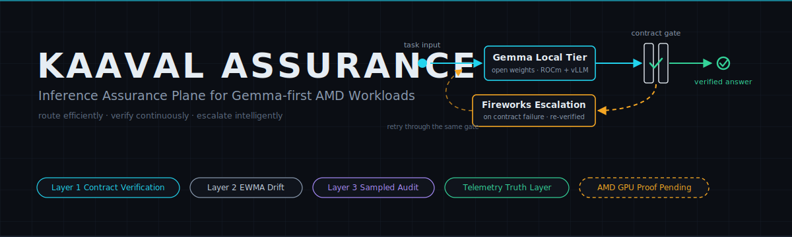
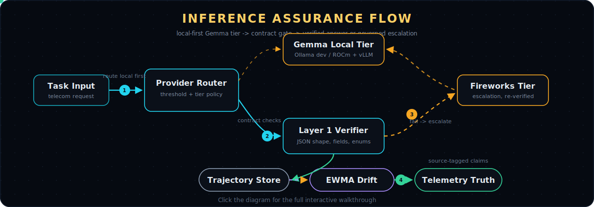

# Kaaval Assurance



**An inference assurance plane for Gemma-first AMD workloads.**

Kaaval Assurance sits between a task and a model answer. It runs a local
open-weight tier first, verifies every response against an explicit task
contract before anyone downstream sees it, escalates only when verification
fails or quality drifts, and records every attempt as a replayable trajectory.
The result is not "a model answered" — it is a verified answer with evidence:
who served it, what it cost, which checks it passed, and why it was routed
there. Built for AMD Developer Hackathon ACT II, Track 3 (Unicorn / Open
Innovation). Product wrapper: **KaavalAI**; this repo is the reusable engine.

*Route efficiently. Verify continuously. Escalate intelligently.*

## Why this matters

Open-weight models are now good enough to run real workloads locally — and
cheap enough that not doing so is leaving money on the table. What teams lack
is the control plane: something that decides when the local answer can be
trusted, when to pay for a stronger model, and how to prove either decision
afterwards. Guardrails check format. Routers predict and hope. Neither leaves
an audit trail.

The question Kaaval Assurance answers is not *which model responded*. It is:
**can we prove the answer satisfied the task contract, at the lowest reliable
cost?**

This is not a debate bot, a chatbot, or a generic eval app. It is governed
inference: verifier-gated escalation, source-tagged telemetry, and a cost per
verified answer you can defend line by line.

## What it does

1. A provider-neutral router sends each request to the **Gemma-first local
   tier** — open-weight local inference through an OpenAI-compatible endpoint
   (Ollama for development, ROCm + vLLM on an AMD GPU VM for deployment).
2. **Layer 1 contract verification** checks the response against the task
   contract deterministically: JSON shape, required fields, enums, numeric
   ranges. Pure code; no model judges another model inline.
3. Failures escalate to the **Fireworks AI escalation tier**, whose response
   is verified the same way — malformed output from the expensive model fails
   too, recorded as such.
4. **Layer 2 trajectory / EWMA drift tracking** aggregates verifier outcomes
   per task category. A deterministic policy maps drift bands to routing
   thresholds: a category that starts failing gets pre-routed to the remote
   tier, with the reason written into every routing decision.
5. **Layer 3 sampled adversarial audit** re-examines a sample (default 10%)
   of already-accepted answers offline. A **calibrated challenger** attacks
   each answer against the contract's semantic intent and returns structured
   violations JSON. Detection is model-generated; aggregation and
   thresholding over that output are deterministic. Before the signal is
   trusted, the challenger must pass a false-positive calibration against
   known-good gold answers — an over-eager critic gets its signal quarantined,
   not believed. It is a statistical sensor, never a per-response gate.
6. Every attempt — input, raw output, checks, tokens, latency, cost, routing
   reason — lands in a SQLite trajectory store as a **replayable trajectory**
   row. Any request can be replayed and re-verified later.

## Architecture

[](docs/kaaval-assurance-architecture.html)

Click the flow for the interactive walkthrough: [HTML](docs/kaaval-assurance-architecture.html) · [notes](docs/kaaval-assurance-architecture.md)

## Built features

| Capability | Status | Why it matters |
|---|---|---|
| Provider-neutral runtime + factory | Built | Local/remote tiers swap by config, never by code edits; switching is explicit and telemetry-visible |
| Mock provider | Built | Entire loop runs deterministically with zero cloud access — tests, demos, CI |
| Ollama local provider | Built | Open-weight local inference on a dev machine; validates the local-tier path before GPU time is spent |
| vLLM provider for AMD GPU VM | Built — pending measured GPU run | The deployment path for Gemma on ROCm + vLLM; records serving knobs in a runtime profile |
| Fireworks AI escalation tier | Built, smoke-tested live | Verified remote escalation with cost/token capture; spend requires explicit confirmation |
| Layer 1 contract verifier | Built | Deterministic accept/reject with stable check IDs — the source of truth |
| Layer 2 EWMA drift + closed-loop routing | Built | Detects per-category degradation and tightens routing automatically, with recorded reasons |
| Layer 3 sampled audit + calibration gate | Built | Catches well-formatted-but-wrong answers; calibration stops critic false positives from poisoning routing |
| Telemetry truth layer | Built | Every judge-facing claim maps to a stored field with a source tag |
| Runtime probe | Built | Turns runtime claims from configured into measured; redacts secrets |
| Streamlit demo console | Built | Live interactive runs plus replay of captured artifacts; hostable without secrets |

The full test suite (220+ tests) runs network-free; live calls are explicit, opt-in CLI/script paths.

## AMD + Gemma execution model

The system is designed around a **Gemma-first local tier on AMD GPU
infrastructure**: open weights, an open serving stack (ROCm + vLLM), and
hardware the operator controls — which is also what makes deeper white-box
signals (logprobs today, more later) structurally available to the assurance
plane.

Execution tiers, honestly labeled:

- **Development:** Ollama serves Gemma-family models locally for validating
  the open-weight path. This proves the code path, not AMD usage — its
  hardware target is recorded as `local-mac-ollama` and can never masquerade
  as an AMD run.
- **Deployment / proof:** one clean Gemma run through vLLM/ROCm on **AMD
  Developer Cloud** or another **AMD GPU VM**, captured through the runtime
  probe and eval telemetry. The probe records measured facts — GPU/runtime
  availability, served model id, model family, provider, latency, tokens,
  verifier results, escalations, and cost fields.
- **Status:** the AMD GPU measured run is **pending**. Until its artifacts
  exist, every runtime claim in this repo stays tagged `configured` or
  `planned` — nothing pretends otherwise, and the "every token on AMD
  silicon" story is only claimable after that artifact lands.

If Gemma cannot be served reliably on the target GPU, the documented fallback
(Qwen via the same vLLM path) is recorded truthfully in telemetry
(`VLLM_MODEL_FAMILY=qwen`) — model id and family are telemetry fields, not
marketing claims.

## Telemetry truth layer

Every claim maps to a stored field, and every field carries a source tag:

- `measured` — derived from stored trajectory rows and run results (this
  includes derived aggregates like rates and cost-per-answer, which are
  deterministic functions of measured rows)
- `configured` — recorded runtime settings (vLLM/Gemma serving knobs), not
  measurements
- `not_available` — the provider or run did not produce the value; never
  fabricated
- `planned` — intended deployment not yet executed (the AMD GPU run, until
  its artifacts exist)

Shipped sample data for the demo console is additionally labeled as
synthetic sample data in the UI and enforced by tests to never claim a
measured runtime.

Captured per attempt and per run: provider, model id, model family, tier,
latency, prompt/completion/total tokens, cost, verifier pass/fail with failed
check IDs, escalation reason, **remote calls avoided** (only when a cached
always-remote baseline exists), **cost per verified answer**, audit
calibration false-positive rate, and the runtime profile (endpoint type,
host, dtype, KV-cache mode, tensor parallelism, GPU memory utilization,
prefix caching, structured-output mode).

```bash
kaaval-eval --dataset data/eval/telecom_gold.jsonl \
  --audit-provider mock --audit-sample-rate 1.0 --telemetry-summary
```

## Demo

The Streamlit console ([apps/demo_console/app.py](apps/demo_console/app.py))
has two tabs:

- **Live demo run** — drives the real assurance pipeline interactively:
  choose a contract, a gold input, a local provider (mock or Ollama), a
  remote provider (mock, or Fireworks behind an explicit spend checkbox),
  and an injected failure mode; watch Layer-1 verification, escalation, and
  the trajectory rows land; export the run as artifacts.
- **Artifact replay** — renders captured artifacts: request flow, runtime
  profile with source tags, the telemetry truth table, and a replayable
  trajectory example.

A hosted copy needs no secrets and no live model endpoint: it ships with
labeled sample artifacts and switches automatically once real AMD run
artifacts are copied in ([docs/hosted-demo.md](docs/hosted-demo.md)).

Note for judges: Track 3 pre-screening inspects the repo, the slide deck
PDF, and the hosted URL — it does not process the demo video. The evidence
lives in this repo's telemetry artifacts and the deck built from them.

## Quickstart

```bash
pip install -e ".[dev]"
pytest                                              # full suite, network-free

# mock eval: full loop, zero cloud access
kaaval-eval --dataset data/eval/telecom_gold.jsonl \
  --audit-provider mock --audit-sample-rate 1.0 --telemetry-summary

# demo console
pip install -e ".[demo]"
streamlit run apps/demo_console/app.py

# Fireworks escalation smoke (spends credits; explicit confirmation required)
set -a; source .env; set +a
kaaval-eval --dataset data/eval/telecom_gold.jsonl \
  --remote-provider fireworks --confirm-spend \
  --failure-mode bad_enum --failure-rate 0.25

# Gemma on AMD GPU VM via ROCm + vLLM (once the endpoint exists)
python -m kaaval_assurance.runtime_probe --output artifacts/runtime-probe.json
kaaval-eval --dataset data/eval/telecom_gold.jsonl \
  --local-provider vllm --telemetry-summary
```

Configuration is environment-only — copy [.env.example](.env.example) to
`.env` (never committed) and fill in. No secrets live in this repo.

## Current submission status

| Item | Status |
|---|---|
| Core assurance engine (contracts, Layer 1–3, routing, trajectories) | Complete |
| Fireworks API escalation path | Complete, smoke-tested locally; public proof artifact pending final submission run |
| Local Ollama development path | Complete |
| vLLM/ROCm provider for AMD GPU VM | Implemented |
| AMD GPU measured run | **Pending** — awaiting credits/pod; final artifact outstanding |
| Telemetry truth layer + runtime probe | Complete |
| Demo console (live + replay) | Complete |
| Deck / video | To be finalized from captured artifacts |

## Limitations

- The eval set is synthetic telecom-triage data (16 gold cases across 4
  contracts); distribution-shift scenarios are simulated, and we say so on
  camera.
- Layer 1 verifies structure and constraints — schema, required fields,
  enums, ranges. It does not certify semantic truth; that gap is exactly what
  the sampled Layer 3 audit exists to estimate, statistically.
- Layer 3 detection is model-generated and sampled. It is calibrated against
  gold answers before its signal is trusted, and it never gates a live
  response.
- No AMD performance or usage claim is made without a measured runtime
  artifact; until the GPU run lands, those claims are explicitly `pending`.
- Cost figures are computed from configured per-token prices; accuracy
  follows the configuration.
- This is hackathon-stage software: no auth, no multi-tenant hardening, no
  production-safety claims.

## Docs

- [docs/hackathon-ops.md](docs/hackathon-ops.md) — ops runbook: pod setup, Gemma-first serving with truthful fallback, smoke sequence, Fireworks budget guardrails
- [docs/submission-checklist.md](docs/submission-checklist.md) — Track 3 assets and AMD proof artifacts
- [docs/demo-script.md](docs/demo-script.md) — 2-minute video plan
- [docs/deck-outline.md](docs/deck-outline.md) — 5-slide deck script
- [docs/hosted-demo.md](docs/hosted-demo.md) — hosting the replay console without secrets

## License

MIT — see [LICENSE](LICENSE).
