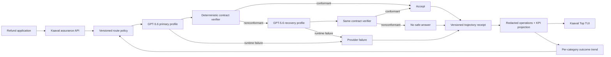

# Kaaval Top - OpenAI Build Week Product and Build Brief

Status: draft for team alignment; not an implementation claim

Date: 2026-07-13

Target track: Developer Tools

Canonical product name: **Kaaval Top**

Canonical command: `kaaval top`

Submission deadline: 2026-07-21 at 5:00 PM Pacific

## 1. Executive Decision

Kaaval Top is a local operator console for AI decisions that are governed by
Kaaval contracts.

It answers three questions:

1. How much eligible business work completed automatically?
2. How much of that automated work crossed the declared contract boundary?
3. What should the system route differently to increase contract-conformant
   automation without releasing nonconformant decisions?

The hackathon submission is not a generic AI observability dashboard, a general
agent, or the Kaaval enterprise control plane. It is one complete developer
workflow:

```text
OpenAI Responses API / GPT-5.6
  -> Kaaval contract checks
  -> deliver, recover, withhold, or record runtime failure
  -> versioned trajectory receipt
  -> redacted KPI/KCI projection
  -> Kaaval Top
  -> deterministic category routing feedback
```

The core loop is **assurance-informed routing**, not autonomous prompt
rewriting. Kaaval does not currently have an improvement agent, and this brief
does not require one.

GPT-5.6 generates or recovers the candidate business decision. Deterministic
Kaaval code decides whether that candidate conforms to the declared contract.
The model never grades or promotes itself.

## 2. YC-Style Pitch

### One sentence

> Kaaval Top is `top` for governed AI decisions: it shows how much business work
> an AI system completes under contract, why automation leaks into recovery or
> human handling, and how routing changes improve that result without weakening
> the acceptance boundary.

### The problem

Enterprises can observe model calls, latency, and token usage, but those facts do
not answer the business question: **did the AI complete the decision it was
allowed to make?**

When an AI refund workflow fails, teams usually cannot distinguish these cases
cleanly:

- the provider was unavailable;
- the model omitted required evidence;
- the proposed refund exceeded delegated authority;
- a bounded recovery produced a conformant answer;
- no safe answer existed and the system correctly withheld output;
- an output was delivered despite failing the declared boundary.

Without that separation, an automation-rate dashboard can reward unsafe output,
and an error-rate dashboard can punish correct fail-closed behavior.

### The customer

The first user is an AI platform or application engineer operating a bounded
business workflow such as refund decisions.

The economic buyer is the owner of that workflow: support operations,
back-office operations, or an enterprise AI platform leader.

The risk stakeholder is the person accountable for policy, audit, and delegated
authority.

### The wedge

The developer installs Kaaval, runs the supplied demo without credentials, then
points Kaaval Top at a local Kaaval assurance API:

```bash
uv sync --group dev
uv run kaaval top --demo

KAAVAL_LIVE_RUNS_ENABLED=1 \
  uv run uvicorn apps.api.server:app --port 8000
uv run kaaval top --endpoint http://127.0.0.1:8000
```

Those commands are currently **reported external behavior**, not yet verified in
this repository. Phase 0 of the build must import and verify the implementation
before they appear as supported claims.

### Why this can become a business

Kaaval Top is the local adoption surface. The commercial expansion is the same
evidence model with durable shared history, tenant boundaries, RBAC, retention,
alerts, fleet policy, and audit workflows.

The value model is concrete and does not require an invented market-size claim:

```text
incremental operating value
  = additional contract-conformant straight-through decisions
    x configured manual handling cost
    - incremental derived inference cost
```

No dollar value is shown unless the manual handling cost is configured and the
inference inputs are measured. The output must then be labeled `derived`.

## 3. Evidence Boundary and Current Reality

Use these source labels throughout the product and submission:

- `measured`: observed in the referenced run.
- `configured`: supplied as policy, price, threshold, or environment input.
- `derived`: deterministically calculated from measured/configured inputs.
- `sample`: synthetic bundled demonstration data.
- `planned`: designed but not implemented or not executed.
- `not_available`: no valid evidence exists.

### What is verified locally

- The local `kaaval` repository is an early scaffold with a planning document,
  not the reported K Top implementation. `[measured: local inspection,
  2026-07-13]`
- The canonical Kaaval engineering standard requires fail-closed behavior,
  replayable receipts, progressive disclosure, and source-tagged claims.
  `[measured: canonical vault document]`
- NanoCanary is a separate behavioral-measurement service. It is not required
  for this hackathon path. `[measured: local nanoCanary/research state]`

### What is reported but not independently verified here

Milind reported a local K Top MVP with:

- a credential-free demo;
- contract-conformant, recovered, no-safe-answer, and provider-failure states;
- a redacted operations schema and snapshot endpoint;
- bounded polling over process-local sessions;
- contract/check/attempt/cost/latency visibility;
- 390 tests, wheel installation, and live API-to-terminal verification.

The implementation worktree referenced in that report is not present on this
machine. Until imported with commit history and rerun evidence, these remain
`planned` from this repository's point of view. The reported `390 passed` result
is `not_available` for independent verification here.

### Current known business KPI

There is **no measured customer business KPI in the available evidence**.

The current reported telemetry describes technical and assurance outcomes. It
does not include a verified customer workload denominator, manual handling
cost, or production operating baseline. The hackathon must not present sample
demo rates or configured cost assumptions as customer results.

## 4. KPI, KCI, and Guardrail Contract

The submission uses one business KPI, one Kaaval control indicator, and one
fail-closed guardrail.

These are **proposed hackathon metric definitions**, not existing measured
customer KPIs. They remain `planned` until implemented and `sample` when shown
over bundled fixtures.

### Business KPI: Straight-Through Resolution Rate (STR)

```text
STR
  = eligible decisions completed without human intervention
    / all eligible attempted decisions
```

STR answers whether automation completed the work. It does not, by itself,
establish that the work conformed to policy.

### Key Control Indicator: Contract-Conformant STR (CC-STR)

```text
CC-STR
  = eligible decisions completed without human intervention
    AND conformant with the active deterministic contract
    / all eligible attempted decisions
```

This is the primary Kaaval indicator. It prevents the product from improving
automation by simply releasing more unchecked output.

Use `contract-conformant`, not `verified`, unless a separate semantic assurance
process has actually run and been calibrated.

### Guardrail: Nonconformant Delivery Rate (NDR)

```text
NDR
  = delivered decisions that did not pass the active contract
    / all delivered decisions

target = 0
```

The production acceptance boundary fails closed. Runtime failure, parse failure,
missing policy, or failed contract checks must not become a delivered answer.

If a window has no delivered decisions, NDR is `not_available`; it is not
silently displayed as zero.

### Denominator contract

An eligible attempt begins only after typed input validation succeeds and the
assurance service allocates a decision/run ID. The production window excludes
duplicate idempotent submissions, health checks, offline replays, and requests
cancelled before inference. Replays use their own separately labeled window.

These rules are versioned with the KPI schema. Changing eligibility changes the
metric definition and requires a schema/formula version change.

### Outcome classification

| Final state | STR numerator | CC-STR numerator | Meaning |
|---|---:|---:|---|
| Direct contract-conformant completion | yes | yes | Automated work completed under contract |
| Automated recovery, final result contract-conformant | yes | yes | Recovery preserved straight-through completion |
| Human escalation | no | no | Work completed outside straight-through automation |
| No safe answer | no | no | Correct fail-closed withholding |
| Provider/runtime failure | no | no | Availability loss, not model behavior |
| Nonconformant output blocked | no | no | Guardrail worked |
| Nonconformant output delivered | yes for raw STR | no | NDR breach; release-blocking defect |

An automated recovery counts only if no human intervened and the final answer
crossed the same active contract boundary.

### Supporting drivers, not headline metrics

These values may be shown only when they explain CC-STR or its economics:

- leakage by stable failed-check ID;
- automated recovery contribution;
- provider/runtime failure contribution;
- no-safe-answer contribution;
- cost per contract-conformant resolution;
- time to contract-conformant resolution.

Do not display a parameter merely because it was captured.

## 5. Concrete Demo Workflow

### Workflow: refund decision

Use synthetic cases only. Each case contains an order reference, refund request,
policy facts, evidence references, and delegated authority limit.

The GPT-5.6 result must conform to a structured `RefundDecision` schema, for
example:

```json
{
  "decision": "approve | deny | escalate",
  "amount": 40.00,
  "currency": "USD",
  "policy_id": "refund-policy-v3",
  "evidence_ids": ["order-status", "payment-status"],
  "reason_code": "within_standard_window"
}
```

The deterministic contract checks, at minimum:

- output schema and types;
- allowed decision enum;
- policy ID exists and matches the active version;
- required evidence IDs are present;
- amount is nonnegative and within delegated authority;
- currency is supported;
- a denial or escalation uses an allowed reason code.

### Five demo cases

| Case | Intended path | Business meaning |
|---|---|---|
| R001 | direct conformant | Ordinary refund completes automatically |
| R002 | primary GPT-5.6 omits policy basis, bounded GPT-5.6 recovery conforms | More automation without human handling |
| R003 | no safe answer | Missing evidence is withheld, not guessed |
| R004 | category is pre-routed to a human-authored GPT-5.6 recovery profile | Prior assurance evidence changes the next route |
| R005 | simulated provider timeout | Infrastructure failure never becomes business behavior |

The demo rates are `sample`. Actual live calls are `measured`. Never combine
sample and live cases in one numerator or denominator.

## 6. The Improvement Loop - No Agent Required

The loop is a deterministic feedback controller over assurance outcomes:

```text
Detect
  contract checks and runtime states produce stable signals

Diagnose
  aggregate failures by workflow/category and stable check ID

Decide
  deterministic routing policy selects primary or recovery profile

Verify
  the next completed decisions produce new receipts and update the trend
```

The reported assurance design already includes per-category EWMA routing state.
That implementation must be verified during import. If it does not exist, it is
new submission work and must be labeled accordingly.

### What the loop may change

For the hackathon, the loop may change only the configured inference route for a
category:

- use the primary profile;
- use one bounded recovery attempt;
- route a degraded category directly to the recovery profile;
- withhold when no conformant answer exists.

Primary and recovery profiles are human-authored, versioned configurations.
The loop selects between them; it does not generate or rewrite them.

### Profile contract

| Property | Primary profile | Recovery profile |
|---|---|---|
| Model | `gpt-5.6` | `gpt-5.6` |
| Business contract | Frozen | Same frozen contract |
| Input facts | Original typed facts and allowed tool results | Same facts; no invented evidence |
| Instructions | Base version | Pre-authored repair version with stable failed-check IDs |
| Reasoning effort | Configured and versioned | Configured and versioned; may differ only if pre-registered |
| Tool policy | Configured and versioned | May require an already-available evidence tool |
| Attempts | One | At most one bounded recovery call |

Recovery may repair an omitted field, malformed structure, or missed use of
already-available evidence. It may not manufacture missing evidence, enlarge
delegated authority, or change policy. Those cases become no safe answer or
human escalation.

It may not:

- rewrite the business contract;
- invent a new threshold after seeing the demo result;
- train or fine-tune a model;
- auto-edit production instructions;
- auto-promote a prompt candidate;
- treat an LLM critique as the acceptance authority.

### How Kaaval knows whether routing improved

Before changing policy, record:

- frozen sample/replay set ID and checksum;
- baseline route policy version;
- candidate route policy version;
- configured EWMA/minimum-sample thresholds;
- expected direction of CC-STR;
- NDR requirement of zero;
- configured cost/latency limits, if any.

Run baseline and candidate on the same frozen cases. Classify each paired case:

- candidate win: candidate is conformant where baseline was not;
- candidate loss: baseline was conformant where candidate was not;
- unchanged conformant;
- unchanged nonconformant;
- runtime-invalid and excluded from behavioral comparison.

A routing candidate can advance to a demo shadow state only when:

- NDR remains zero;
- it has no baseline-pass regressions on the frozen demo set;
- it improves the targeted failed-check cluster;
- runtime-invalid cases are excluded rather than scored;
- configured cost/latency constraints are satisfied.

If the sample is too small or mixed, the result is `inconclusive`, not `pass`.
The hackathon demonstrates the mechanism; it does not claim statistical
production validation.

Kaaval can establish only that a route improved results against the declared
contract and frozen evidence. A wrong or incomplete contract can optimize the
wrong outcome. The business owner must approve the contract and representative
cases; periodic human review remains required.

### Why no GPT-5.6 improvement agent in the core build

An agent that proposes prompt changes would introduce another nondeterministic
component, another evaluation surface, and another claim the team must validate
before the deadline. It is not needed to prove the Kaaval loop.

GPT-5.6 is materially used in the decision/recovery path. A future bounded
proposal assistant can be added after the deterministic routing loop is working
and replay evidence exists. It would remain advisory and human-gated.

## 7. Architecture



### Architectural boundaries

#### Assurance core

Owns provider calls, routing, deterministic checks, bounded recovery,
fail-closed withholding, and canonical receipts.

#### Operations projection

Converts sensitive receipts into a versioned, content-free schema. It may expose
stable IDs, states, counts, source labels, model/provider identity, and measured
usage. It must not expose prompts, responses, tool arguments, credentials,
exception bodies, or sensitive paths.

#### Kaaval Top

Renders outcomes, CC-STR, NDR, leakage causes, and route changes. It does not
import or duplicate verifier, router, or provider logic.

For the local MVP, `kaaval top` is a foreground process that polls a redacted
snapshot endpoint. It is not a daemon. Process-local sessions and bounded
polling are acceptable for the hackathon if labeled honestly.

#### Enterprise boundary

Durable tenant-aware history, authentication, RBAC, SSE with reconnect cursors,
cross-worker aggregation, retention/export policy, alerts, and fleet controls
remain future Kaaval Console work.

## 8. OpenAI Responses API Specification

Use the official Python OpenAI SDK and the Responses API. The required model is
`gpt-5.6` (the documented alias for GPT-5.6 Sol).

### Request parameters used in the build

| Parameter | Build use | Business/control relationship |
|---|---|---|
| `model` | `gpt-5.6` for primary and recovery live profiles | Provenance and route segmentation |
| `instructions` | Versioned refund-decision instructions | Controlled configuration tied to receipt version |
| `input` | Synthetic refund case | Business decision input; protected, never in operations view |
| `text.format` | Strict `RefundDecision` schema | Reduces parse failures and enables deterministic checks |
| `tools` | At most bounded order/policy lookup functions if already supported | Supplies evidence required by contract checks |
| `tool_choice` | Explicitly configured and versioned | Explains missing-tool/evidence failures |
| `parallel_tool_calls` | `false` for the bounded demo unless a test proves need | Avoids unnecessary execution nondeterminism |
| `reasoning.effort` | Configured per profile only after live compatibility check | Potential cost/quality lever; not a claim by itself |
| `max_output_tokens` | Bounded | Cost and failure control |
| `metadata` | Non-PII run, workflow, contract, and instruction IDs | Correlation only; never a business metric |
| `store` | `false` by default | Data-minimization default |
| `background` | `false` for the core synchronous workflow | Avoids unnecessary lifecycle complexity |
| `stream` | `false` for the core decision call | TUI observes final assurance states, not raw token streaming |

Do not send customer PII in `metadata`. If the future live application needs a
user-abuse identifier, use a stable hashed `safety_identifier` under a documented
privacy policy.

### Response fields captured in the protected receipt

- response ID;
- response status;
- redacted error class and incomplete details;
- actual model ID;
- service tier when returned;
- output item types and tool names/statuses, without arguments in the operations
  projection;
- input, output, cached-input, and reasoning token counts when returned;
- request start/end timestamps and measured latency.

OpenAI does not return a universally authoritative dollar cost in the response.
Cost is `derived` from measured usage and a versioned configured price table.

Do not store or display hidden chain-of-thought. Store decisions, tool outcomes,
checks, usage, and safe summaries only.

## 9. Kaaval Receipt and Projection Specification

### Protected trajectory receipt

Minimum fields:

```text
receipt_schema_version
run_id
decision_id
timestamp_started
timestamp_completed
code_revision
environment_profile
workflow_id
category
contract_id
contract_version
instructions_version
instructions_hash
route_policy_version
provider
model_id
response_id
attempts[]
check_results[]
final_disposition
human_intervention
safe_to_deliver
usage
latency_ms
cost_basis_version
evidence_source
integrity_checksum
```

The protected store preserves the full input, accepted output, and verification
evidence needed for replay, subject to retention and security policy.

### Redacted operations record

The TUI receives only an allowlisted projection:

```text
ops_schema_version
run_id
decision_id
workflow_id
category
contract_id
contract_version
route_label
final_disposition
failed_check_ids
attempt_count
human_intervention
safe_to_deliver
runtime_failure_class
latency_ms
token_counts
derived_cost
cost_source
evidence_source
timestamp
```

### KPI window

The API, not the TUI's visible row buffer, computes the window denominator and
aggregates. A bounded screen must never recalculate a rate from only the last N
visible rows.

```text
window_id
window_start
window_end
workflow_id
evidence_source
eligible_attempts
straight_through_completions
contract_conformant_straight_through_completions
delivered_decisions
nonconformant_deliveries
leakage_by_cause
```

## 10. Kaaval Top Product Experience

The default screen uses progressive disclosure: outcome and risk first,
engineering details second.

```text
 KAAVAL TOP  |  SAMPLE  |  refund_decision  |  n=5

 CONTRACT-CONFORMANT STRAIGHT-THROUGH
 3 / 5  (60%)                         NONCONFORMANT DELIVERIES: 0

 WHY 2 DECISIONS DID NOT COMPLETE UNDER CONTRACT
 missing_evidence       1   -> correctly withheld
 provider_failure       1   -> runtime unavailable

 RECENT DECISIONS
 R005  PROVIDER_FAILURE   not scored as behavior
 R004  CONFORMANT          recovery profile selected by route policy
 R003  NO_SAFE_ANSWER     required evidence absent
 R002  RECOVERED          missing_policy_basis -> conformant
 R001  CONFORMANT         direct

 ROUTING FEEDBACK
 returns/category-a  PRIMARY -> RECOVERY  reason: configured EWMA gate

 [Enter] receipt  [l] leakage  [r] route evidence  [p] pause  [q] quit
```

Rules:

- Every rate shows numerator, denominator, window, and source label.
- Color never carries meaning without a text state.
- `LIVE`, `SAMPLE`, `REPLAY`, `UNAVAILABLE`, `ENFORCED`, and `DISPLAY ONLY`
  remain visually distinct.
- `UNAVAILABLE` preserves the last snapshot marked stale; it never replaces
  missing data with zero.
- Model ID, response ID, token counts, latency, and route internals are hidden
  from the default view unless they explain the KPI/KCI or the operator opens a
  receipt.
- Raw model content never appears.

### HTML surface

A local HTML mirror is a stretch feature, not the core submission. If built, it
must consume the same redacted projection and bind to `127.0.0.1` by default.
It must not create a second KPI implementation.

A static redacted HTML export is lower risk than a network-shareable live
dashboard. Network sharing requires authentication, TLS, tenant isolation, and
RBAC and therefore remains outside the hackathon claim.

## 11. Build Plan

### Phase 0 - Evidence and ownership gate

Goal: establish what actually exists before changing architecture.

Tasks:

- Import or access Milind's `kaaval-assurance` repository and full commit
  history.
- Record the pre-submission baseline commit and timestamp.
- Record all commits created after 2026-07-13 09:00 Pacific.
- Rerun the reported test suite, wheel build, empty-environment install, demo,
  and live local path.
- Save one redacted receipt fixture and one TUI screenshot.
- Inventory current provider, router, receipt, ops, and TUI interfaces.
- Confirm whether the reported EWMA route-adjustment loop is implemented or
  design-only.
- Create `PRIOR_WORK.md` distinguishing pre-existing assurance work from
  Build Week extensions.

Exit criterion: current-state matrix contains file/commit/test evidence for
every retained capability. No architecture work starts from the chat report
alone.

### Phase 1 - GPT-5.6 Responses provider

Goal: make GPT-5.6 a first-class provider behind the existing provider
interface.

Tasks:

- Add `OpenAIResponsesProvider` without bypassing the assurance pipeline.
- Add typed configuration and secret-safe loading.
- Add strict structured output for `RefundDecision`.
- Add bounded timeout/retry rules that preserve fail-closed behavior.
- Normalize status, usage, tool outcome, and redacted provider errors.
- Add mock, malformed-output, timeout, quota, and successful-live tests.
- Run one paid live smoke only after explicit spend approval.

Exit criterion: one GPT-5.6 refund decision reaches the same deterministic
contract and receipt path as existing providers, with a replayable receipt and
no raw content in the operations projection.

### Phase 2 - KPI/KCI projection

Goal: turn receipts into one business outcome and one assurance control
indicator.

Tasks:

- Add versioned outcome classification.
- Add STR, CC-STR, and NDR formulas with denominator tests.
- Distinguish automated recovery from human escalation.
- Exclude runtime-invalid events from model-behavior claims while retaining them
  in business availability accounting.
- Add leakage aggregation by stable check ID.
- Add source labels and cost-basis versioning.
- Add fixture tests for every row in the outcome table.

Exit criterion: all five demo cases produce the pre-registered numerator,
denominator, guardrail, and leakage results without TUI code.

### Phase 3 - Kaaval Top KPI-first redesign

Goal: make the product legible in under 30 seconds.

Tasks:

- Preserve the existing receipt list, pause, refresh, filtering, and keyboard
  behavior where verified.
- Replace metric inventory with CC-STR, NDR, leakage causes, and route evidence.
- Add receipt drill-down with source labels.
- Add stale/unavailable behavior.
- Test narrow and wide terminal layouts, keyboard flow, redaction, and no-color
  state recognition.
- Keep `kaaval top --demo` credential-free and deterministic.

Exit criterion: a new judge can run the demo and correctly explain the business
outcome, guardrail, and one recovery path without reading documentation.

### Phase 4 - Assurance-informed routing loop

Goal: show that receipts alter a future system decision.

Tasks:

- Verify or implement versioned per-category EWMA state.
- Keep thresholds/minimum samples configured and visible as `configured`.
- Implement one deterministic route transition: primary to GPT-5.6 recovery
  profile for a degraded category.
- Pre-register the frozen replay and expected acceptance conditions.
- Run baseline and candidate route policy on identical sample cases.
- Write a route-decision receipt containing old policy, new policy, reason, and
  evidence window.
- Show the route transition and replay result in Kaaval Top.

Exit criterion: the demo proves signal -> deterministic route decision -> new
receipt -> replayed outcome. No LLM decides whether its own route is promoted.

### Phase 5 - Packaging and submission evidence

Goal: satisfy the actual Build Week rules and judging criteria.

Tasks:

- Clean install and runnable demo without rebuilding from source.
- Public or judge-accessible repository with license and testing instructions.
- README section explaining Codex collaboration, human decisions, and GPT-5.6
  use.
- Timestamped Codex session IDs/logs and dated commit history.
- Less-than-three-minute public YouTube demo with audio.
- Exact prior-work/new-work table.
- Security/secret scan, dependency scan, final claim audit, and rollback path.
- Verify the final video, README, TUI, and receipts use the same terminology.

Exit criterion: a judge can install, run, and understand the project from a
clean environment, and every submission claim maps to an inspectable artifact.

## 12. Technical Acceptance Matrix

| Capability | Required test/evidence |
|---|---|
| GPT-5.6 provider | Mock contract tests plus one approved live smoke |
| Structured output | Valid, malformed, missing-field, wrong-type cases |
| Contract boundary | Every failure path withholds output |
| Recovery | One attempt maximum in demo; same contract re-applied |
| Runtime failure | Provider outage recorded, never scored as model behavior |
| Receipt integrity | Version, checksum, replay round-trip |
| Redaction | Sentinel prompts/responses/keys/errors absent from ops/TUI/export |
| KPI formulas | Table-driven numerator/denominator tests |
| Route loop | Frozen paired replay and policy-decision receipt |
| TUI | Keyboard, layout, stale state, source labels, screenshot |
| Packaging | Fresh wheel/container install and console invocation |
| Claims | Independent README/UI/video vocabulary audit |

## 13. Three-Minute Demo Script

### 0:00-0:20 - Problem

"AI teams can see tokens and latency, but not how much business work completed
under the policy boundary or why automation stopped."

### 0:20-0:45 - Credential-free product

Run `kaaval top --demo`. Show the five labeled sample outcomes and the fact that
raw prompts/responses are absent.

### 0:45-1:20 - Live GPT-5.6 path

Submit one synthetic refund decision through the Responses provider. Show the
contract result and redacted receipt appear in Kaaval Top.

### 1:20-1:50 - Fail closed and recover

Show a missing-evidence or authority failure. The primary result is blocked; one
bounded GPT-5.6 recovery either crosses the same contract or becomes no safe
answer.

### 1:50-2:25 - Close the loop

Show the category trend crossing a configured gate, the deterministic route
policy changing for the next sample, and the route-decision receipt. Replay the
same frozen cases and show whether CC-STR improved while NDR stayed zero.

### 2:25-2:45 - Business value

Show CC-STR and the largest leakage cause. If manual handling cost is configured,
show the derived economic formula with its source label. Otherwise show
`not_available` rather than inventing ROI.

### 2:45-3:00 - Why Kaaval

"OpenAI produces the decision. Kaaval proves whether it crossed the declared
business contract, records why it was accepted or withheld, and uses that
evidence to route the next decision more intelligently."

## 14. Hackathon Criteria Mapping

### Stage One: required technology fit

- Codex is used for the submission-period implementation, tests, review, and
  evidence capture.
- GPT-5.6 is used materially in the live decision/recovery path through the
  Responses API.
- The project is runnable and behaves as shown.
- Prior and new work are explicitly separated.

### Technological implementation

- Nontrivial provider integration, typed schemas, tools/structured output,
  deterministic assurance, recovery, versioned receipts, replay, and routing
  feedback.
- Codex contribution is documented with session and commit evidence.

### Design

- One coherent install-to-decision-to-receipt-to-TUI workflow.
- Credential-free demo plus optional live path.
- Outcome-first UI with clear failure and unavailable states.

### Potential impact

- Specific audience: teams automating policy-bounded business decisions.
- Specific outcome: increase contract-conformant straight-through work while
  keeping nonconformant deliveries at zero.
- Economic value computed only from inspectable inputs.

### Quality of idea

- The product does not stop at model-call observability.
- Contract outcomes drive a deterministic routing decision, producing a closed,
  replayable assurance loop.
- This is the submission thesis, not a claim that no prior product has ever used
  feedback control.

## 15. Prior Work vs Submission-Period Work

This table must be replaced with commit-backed facts after Phase 0.

| Surface | Prior work status | Submission-period extension |
|---|---|---|
| Contract verifier | Reported pre-existing | Preserve; add refund/OpenAI fixtures if needed |
| Provider interface | Reported pre-existing | Add official GPT-5.6 Responses provider |
| Recovery/NoSafeAnswer | Reported pre-existing | Exercise through OpenAI path and receipt evidence |
| Trajectory receipts | Reported pre-existing | Version OpenAI fields and KPI evidence |
| K Top TUI | Reported built on 2026-07-13; commit timing unverified | KPI-first design, route evidence, OpenAI live demo |
| Operations snapshot | Reported pre-existing | Versioned KPI/KCI projection |
| EWMA routing | Reported pre-existing; implementation unverified | Verify, make route changes replayable, expose evidence |
| Improvement agent | Does not exist in available evidence | Not in core submission |
| NanoCanary | Separate built service | Excluded from hackathon core |
| Enterprise Console | Planned | Excluded |

The official rules state that pre-existing projects are evaluated only on work
added during the submission period and require clear documentation of prior vs
new work plus Codex/GPT-5.6 evidence. Commit history, not conversation memory,
must settle this table.

## 16. Explicit Non-Goals

- No autonomous Kaaval improvement agent.
- No automatic instruction or contract mutation.
- No NanoCanary integration in the hackathon critical path.
- No MCP server in the critical path.
- No Strands SDK integration in the critical path.
- No claim of arbitrary OpenAI/agent traffic discovery.
- No full multi-provider enterprise gateway.
- No durable multi-tenant control plane.
- No benchmark, uptime, accuracy, savings, or market-size claim without evidence.
- No live network-shared HTML dashboard without auth/TLS/RBAC.
- No hidden chain-of-thought storage.

## 17. Risks and Kill Rules

| Risk | Response |
|---|---|
| Reported K Top code cannot be imported/verified | Stop product expansion; establish repository truth first |
| GPT-5.6 access/quota unavailable | Keep credential-free sample demo, but submission cannot claim live GPT-5.6 completion |
| Structured output is unreliable | Strict parse, deterministic check, withhold; simplify schema rather than loosen contract |
| EWMA loop is not implemented | Build one minimal deterministic category route or label loop planned; never fake learning |
| Demo KPI depends on tiny sample | Label `sample`, show counts, avoid production/statistical claim |
| Recovery increases cost without enough value | Show measured usage and derived cost; do not claim optimization |
| TUI becomes a metric wall | Remove any field without KPI/KCI, diagnosis, action, or audit purpose |
| Build expands into agent/MCP/HTML/control plane | Cut those surfaces; protect the core loop |
| Existing/new work provenance unclear | Block submission until commit/session evidence is complete |

## 18. Definition of Done

The hackathon build is complete only when:

1. A clean install runs `kaaval top --demo` without credentials.
2. One approved live GPT-5.6 refund call traverses the real assurance path.
3. Every output is delivered, recovered, withheld, or runtime-failed explicitly.
4. Runtime errors never become model behavior or zero-valued success.
5. Receipts are versioned, checksummed, redacted for operations, and replayable.
6. STR, CC-STR, and NDR formulas pass all outcome-table tests.
7. One assurance signal produces a deterministic route decision for a future
   case and a route-decision receipt.
8. Frozen replay shows the route result without an unsafe regression, or labels
   it inconclusive/rejected honestly.
9. The TUI communicates outcome, leakage, and route evidence in under 30 seconds.
10. README, video, TUI, and receipts use the same evidence vocabulary.
11. Prior work and submission-period work are separated by dated commits and
    Codex session evidence.
12. Security, dependency, clean-install, and independent claim-review gates pass.

## 19. Sources

### Canonical Kaaval sources

- `kaaval/build/kaaval-engineering-operating-standard` in the local Obsidian
  vault.
- `kaaval/products/k-top-openai-hackathon` in the local Obsidian vault.
- `kaaval/products/kaavalai-v3-merged-build-brief` in the local Obsidian vault.
- `kaaval/products/kaaval-assurance-final-sprint-notes` in the local Obsidian
  vault.
- `docs/k-top-openai-hackathon.md` in this repository.

### Official Build Week source

- [OpenAI Build Week official rules](https://openai.devpost.com/rules)

Relevant rule-backed constraints:

- submission period: July 13-21, 2026;
- project must use Codex and GPT-5.6;
- existing projects must be meaningfully extended during the submission period;
- prior vs new work and Codex/GPT-5.6 evidence must be documented;
- demo video must be under three minutes;
- repository and testing access are required;
- Developer Tools is an eligible track;
- judging equally weights technological implementation, design, potential
  impact, and quality of idea.

### Official OpenAI technical sources

- [GPT-5.6 Sol model documentation](https://developers.openai.com/api/docs/models/gpt-5.6-sol)
- [Responses API create reference](https://developers.openai.com/api/reference/resources/responses/methods/create)
- [OpenAI tools guide](https://developers.openai.com/api/docs/guides/tools)
- [OpenAI evaluation best practices](https://developers.openai.com/api/docs/guides/evaluation-best-practices)

The evaluation guide supports eval-driven development, task-specific datasets,
continuous evaluation, pairwise/classification-oriented checks, and human
calibration. It also warns against vibe-based evaluation and unnecessary
multi-agent complexity. The current OpenAI Evals platform is documented as
being deprecated in late 2026, so this build uses a local replay/evidence
harness rather than introducing a dependency on that hosted platform.
