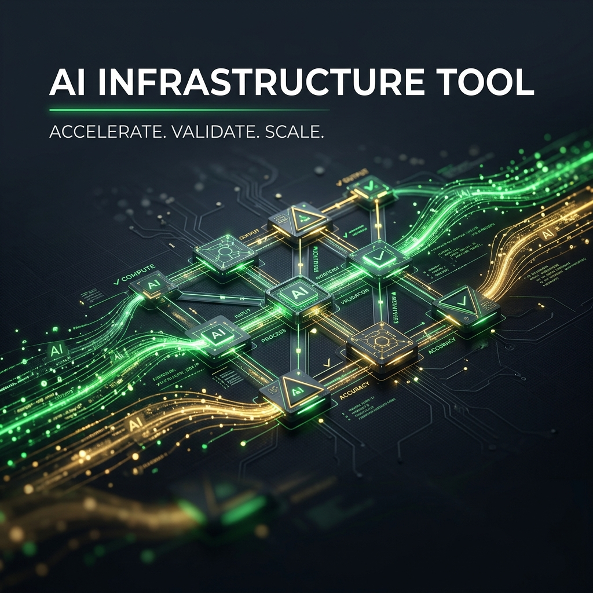
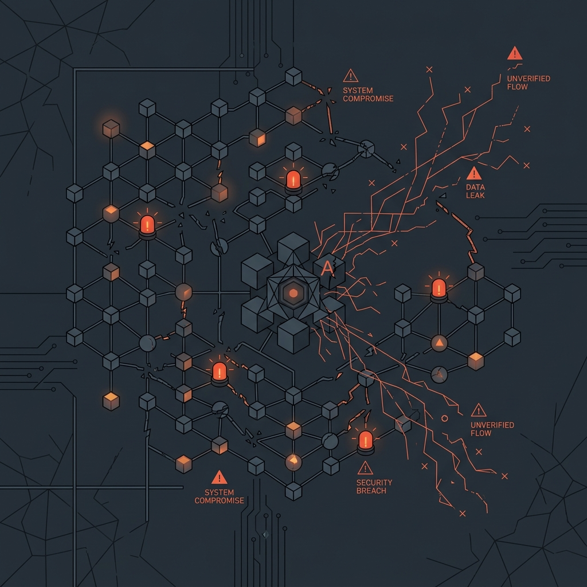
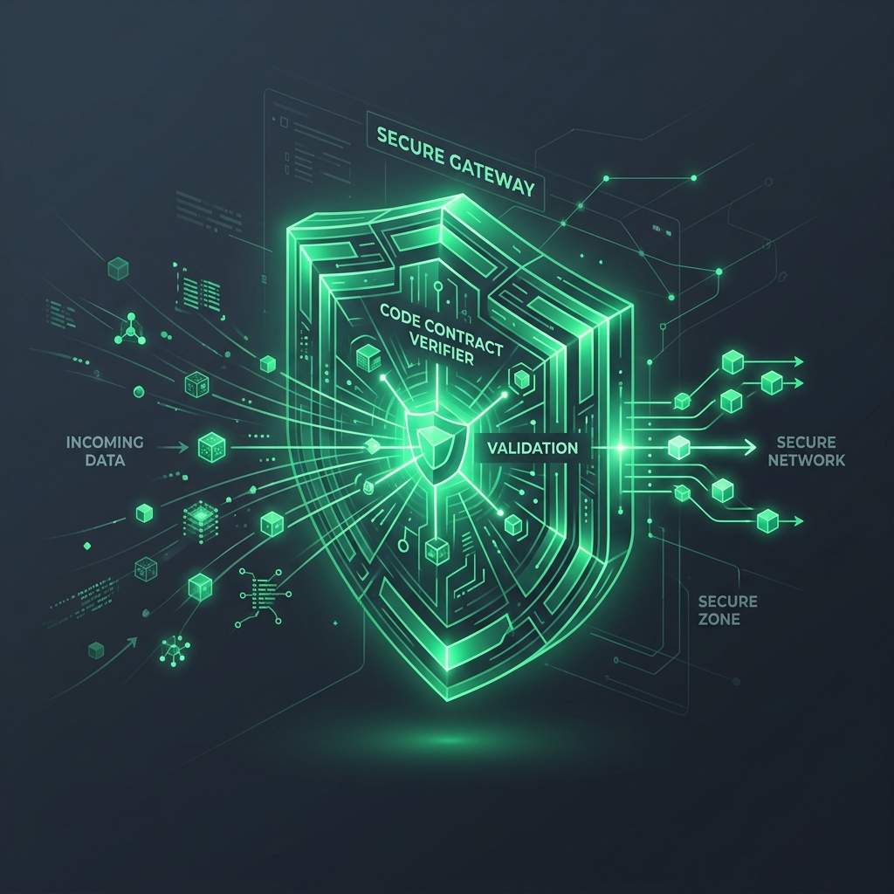

# Kaaval Assurance

  

    <h2 style="color: #10B981; margin-top: 0;">Routers predict. Kaaval verifies.</h2>
    
An inference assurance plane for open-weight models on AMD compute.

    <em style="color: #ffd166; font-size: 14px; font-family: monospace;">Verify, not predict. Receipts, not promises.</em>
  

  

    
  

---

## The Problem: Accountability Gap

  

    
<strong>The Accountability Gap:</strong> If an AI agent makes the wrong transaction, the enterprise still owns the customer outcome and liability.

    
<strong>The Fluent Failure Mode:</strong> Unsafe AI answers are fluent and grammatically correct—but factually or legally wrong. Standard guardrails check syntax; they cannot verify business logic.

    
<strong>The Business Risk:</strong> As agents handle refunds, claims, and quotes, quality drift translates directly into financial exposure.

  

  

    
  

---

## The Solution: Kaaval Product

  

    <ol>
      <li><strong>Local First:</strong> Run task on cheap, local open-weight models (Gemma) on owned hardware.</li>
      <li><strong>Real-time Gate:</strong> Intercept response and test against a strict code contract <em>before</em> it ships.</li>
      <li><strong>Fail-Safe Escalation:</strong> Automatically route to a remote backup tier only when local verification fails.</li>
      <li><strong>Decision Receipts:</strong> Store every transaction, latency, cost, and verifier check in an auditable database.</li>
    </ol>
  

  

    
  

---

## Three-Layer Assurance Architecture

  

    
<strong>Layer 1: Contract Conformance</strong> 
    Structured JSON schema, enums, range checks, and grounding rules. Deterministic, code-only checks (no LLM judging LLM).

    
<strong>Layer 2: Adaptive Drift Routing</strong> 
    EWMA failure tracking. Automatically tightens routing thresholds when local quality degrades.

    
<strong>Layer 3: Sampled Offline Audit</strong> 
    Calibration-gated adversarial auditing. Critic model challenges a 10% sample of accepted answers.

  

  

    
  

---

## The Telemetry Truth (Evidence)

No claim without a stored field. No field without a source tag.

| Metric | Captured Value | Source Tag |
|---|---|---|
| **Local Conformance Rate** | `100.0%` | `measured` |
| **Final Verified Rate** | `100.0%` | `measured` |
| **Escalation Rate** | `0.0%` | `measured` |
| **Latency p50 / p95** | `324.6 / 479.6 ms` | `measured` |
| **Inference Cost** | `$0.0000 (Local-First)` | `measured` |
| **Active Run ID** | `live-5be3acfa-amd-gemma-proof` | `measured` |

---

## AMD Proof & Hardware Stack

- **Hardware Stack:** AMD Radeon gfx1100 target, 47.98 GiB VRAM.
- **Software Stack:** vLLM served via ROCm 7.2 + PyTorch 2.9.
- **Measured Proof Bundle:** Locked to source commit `aa8b5b2` with SHA-256 integrity hashes (`SHA256SUMS-amd-aa8b5b2.txt`).

---

## Market Positioning

**Traditional Routers (Guess & Hope):** 
Focus on *predicting* model quality before generation. Useful for text completion, but fails when business contracts cannot tolerate errors.

**Kaaval Assurance (Verify & Adapt):** 
Focus on *measuring* output conformance after generation. Perfect for policy-bound decisions, API spend governance, and auditable automation.

